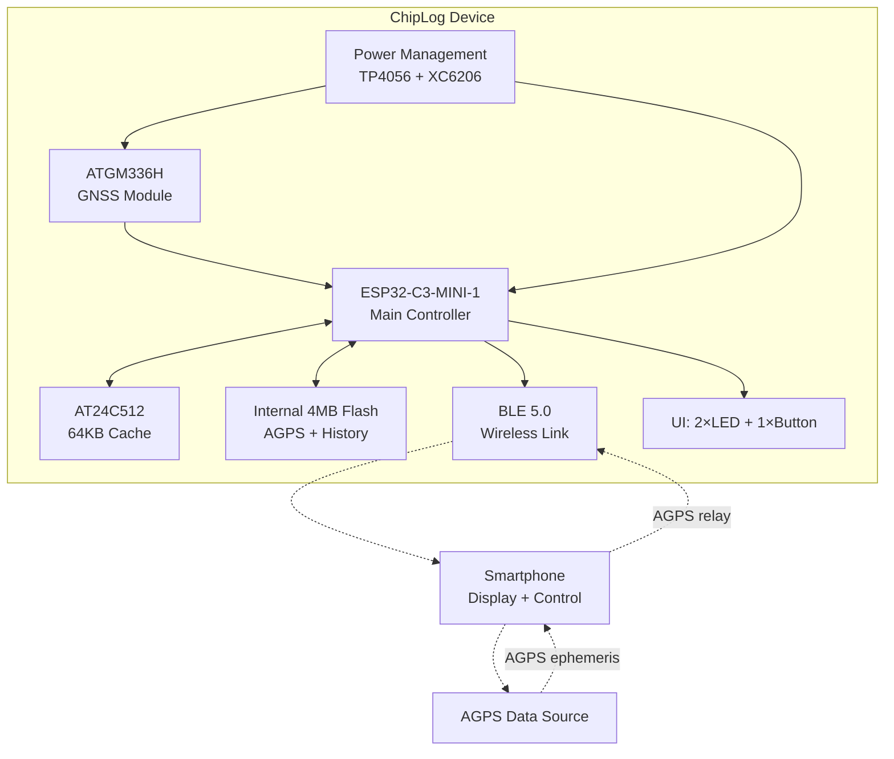
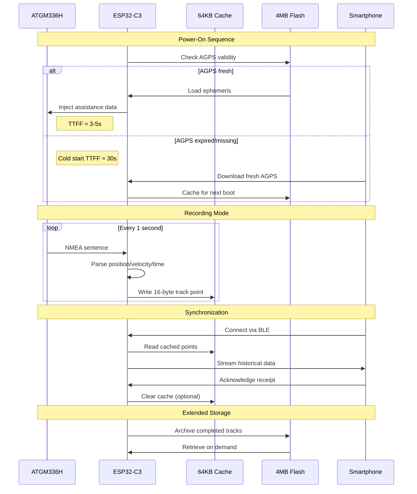
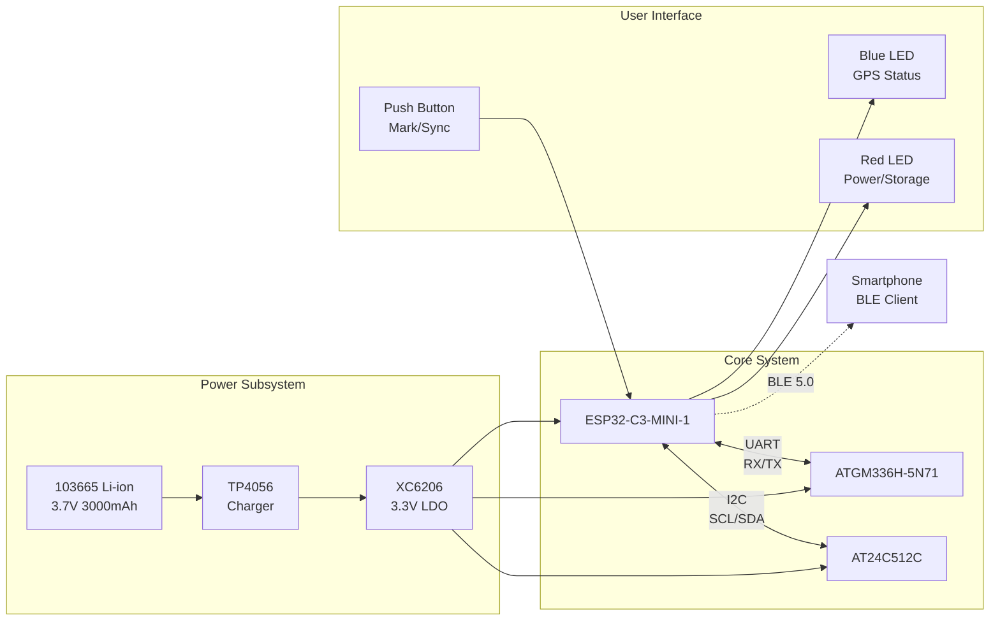
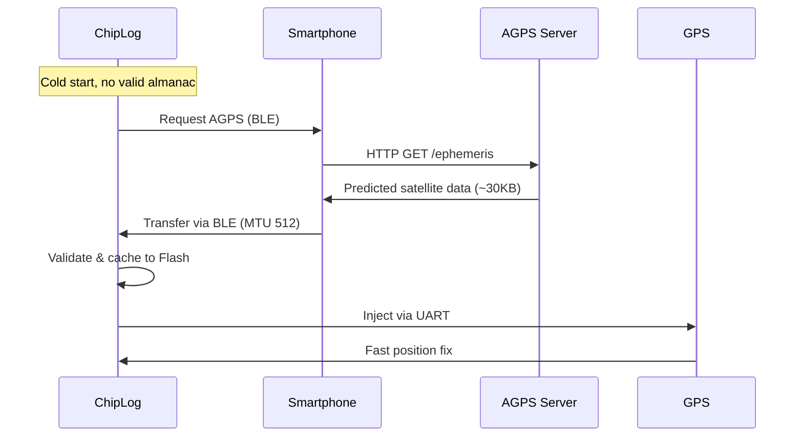
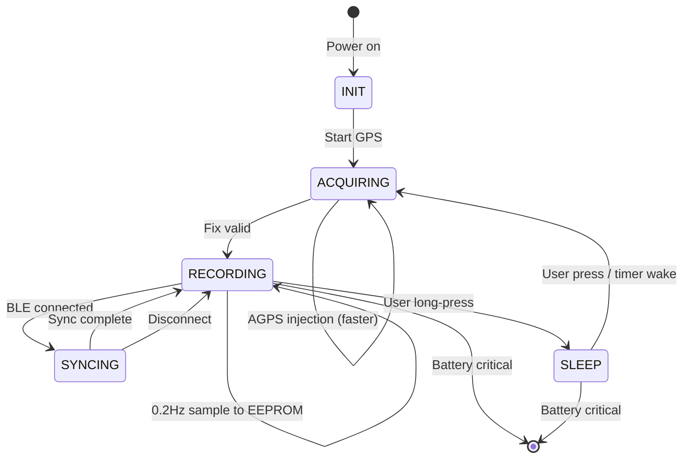
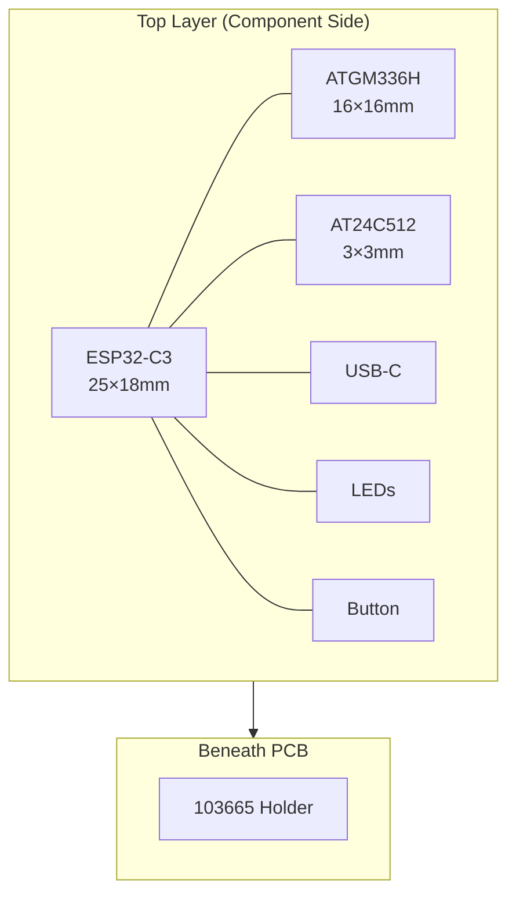

# Project ChipLog: A Minimalist GPS Logger for Outdoor Activities

## Preliminary Technical Proposal Report

---

## 1. Executive Summary

**ChipLog** is a dedicated GPS tracking device designed for cycling and hiking enthusiasts. Inspired by the maritime chip log—the ancient tool sailors used to measure speed and distance—this modern interpretation employs satellite navigation and solid-state storage to record position, velocity, and elevation with minimal power consumption and maximum reliability.

The device operates independently of smartphones, ensuring continuous data capture even when mobile applications are terminated by operating system power management. Data sovereignty resides entirely within the device, with Bluetooth serving merely as an optional conduit for real-time display and historical synchronization.

---

## 2. Background and Motivation

### 2.1 The Problem with Smartphone GPS

Modern smartphones possess capable GPS receivers, yet they fail as reliable outdoor recording devices due to:

- **Background termination**: iOS and Android aggressively suspend GPS-dependent applications to conserve battery
- **Power anxiety**: Continuous GPS usage drains phone batteries required for emergency communication
- **Fragility**: Smartphones are vulnerable to moisture, impact, and temperature extremes
- **Distraction**: Screen-based navigation competes for attention with the environment

### 2.2 Existing Solutions

Dedicated GPS devices from Garmin, Wahoo, and others offer reliability but at substantial cost (USD $150-600) and complexity. These products target competitive athletes rather than casual explorers.

### 2.3 Design Philosophy

ChipLog adheres to three principles:

1. **Autonomy**: Record without smartphone dependency
2. **Longevity**: Extended battery life through hardware-software co-design
3. **Simplicity**: Zero configuration, immediate operation

---

## 3. System Architecture

### 3.1 High-Level Block Diagram



### 3.2 Data Flow Architecture



---

## 4. Hardware Design

### 4.1 Component Selection Rationale

| Component | Model | Key Specifications | Selection Criteria |
|-----------|-------|-------------------|-------------------|
| **Microcontroller** | ESP32-C3-MINI-1 | RISC-V 160MHz, BLE 5.0, 4MB Flash, 5μA deep sleep | Lowest power consumption in ESP32 family; integrated wireless eliminates external Bluetooth module |
| **GNSS Receiver** | ATGM336H-5N71 | GPS+BeiDou+GLONASS, -162dBm tracking, 25mA active | Triple-constellation reception for urban canyon and canopy penetration; cost-effective performance |
| **Volatile Storage** | AT24C512C | 64KB, I2C 400kHz, 6μA standby, 1000K write cycles | Byte-addressable for efficient small writes; superior write endurance versus Flash for frequent track point logging |
| **Power Management** | TP4056 + XC6206 | 1A linear charging, 3.3V/200mA LDO, 1μA quiescent | Minimal external component count; adequate for system load |

### 4.2 Power Budget Analysis

System current consumption by operational mode:

$$
I_{\text{active}} = I_{\text{GPS}} + I_{\text{MCU}} + I_{\text{EEPROM(write)}} + I_{\text{BLE}}
$$

$$
I_{\text{active}} \approx 25\text{mA} + 20\text{mA} + 3\text{mA} + 0\text{mA (idle)} = 48\text{mA}
$$

For a 3000mAh 103665 flat lithium cell:

$$
T_{\text{recording}} = \frac{3000\text{mAh}}{48\text{mA}} = 62.5\text{ hours}
$$

Deep sleep current (between recording sessions):

$$
I_{\text{sleep}} \approx 5\mu\text{A (MCU)} + 6\mu\text{A (EEPROM)} = 11\mu\text{A}
$$

Standby time:

$$
T_{\text{standby}} = \frac{3000\text{mAh}}{11\mu\text{A}} \approx 31\text{ years}
$$

### 4.3 Storage Capacity Modeling

Track point structure (16 bytes):

```c
struct TrackPoint {
  uint32_t timestamp;  // Unix timestamp (s)
  int32_t  lat;        // latitude × 1e7
  int32_t  lng;        // longitude × 1e7
  int16_t  altitude;   // altitude (m)
  uint8_t  speed;      // speed (km/h)
  uint8_t  crc;        // CRC-8 checksum
}; // 16 bytes
```

$$
S_{\text{point}} = 4 + 4 + 4 + 2 + 1 + 1 = 16\text{ bytes}
$$

EEPROM capacity (64KB = 65536 bytes, 8 bytes reserved for meta data:

| Field | Type | Description |
|-------|------|-------------|
| front index |	uint16 | Index of the first unsynced point |
| rear index |	uint16 | Index of the last unsynced point |
| track id | uint16 | Unique identifier for the track |
| flag | uint8 | Status flags (e.g., sync status) |
| crc | uint8 | CRC-8 checksum for meta data |

$$
N_{\text{cache}} = \left\lfloor \frac{65536 - 8}{16} \right\rfloor = 4095\text{ points}
$$

Recording duration at 0.2Hz sample rate:

$$
T_{\text{cache}} = \frac{4095\text{ points}}{0.2\text{ Hz} \times 3600\text{ s/h}} \approx 5.69\text{ hours}
$$

Flash file system allocation (1.5MB for tracks):

$$
N_{\text{archive}} = \frac{1.5 \times 1024 \times 1024}{16} \approx 98304\text{ points}
$$

$$
T_{\text{archive}} = \frac{98304}{0.2 \times 3600} \approx 136.5\text{ hours}
$$

Points are stored in RAM initially, and flushed to EEPROM every 16 points. When the EEPROM reaches 75% capacity, write the oldest 50% to Flash as a LittleFS file, then move front pointer.

**Total autonomous recording capacity**: 136 hours without smartphone synchronization.

### 4.4 Schematic Overview



---

## 5. Communication Protocol

### 5.1 BLE GATT Service Definition

| Name | Type | Description |
|------|------|-------------|
| ChipLog Service | Primary | Main service container |
| Command | Write | Phone-to-device control |
| Realtime Data | Notify | 0.5Hz position stream |
| History Data | Notify/Read | Cached track points |
| Device Status | Read/Notify | Battery, storage, GNSS state |

Note: UUID would be assigned later.

### 5.2 Realtime Data Packet Format

Binary structure (24 bytes, little-endian):


| Field | Type | Scale/Unit | Description |
|-------|------|-----------|-------------|
| type | uint8 | 0x01 | Packet type identifier |
| timestamp | uint32 | Unix epoch seconds | UTC time |
| latitude | int32 | $10^{-7}$ degrees | WGS84 latitude |
| longitude | int32 | $10^{-7}$ degrees | WGS84 longitude |
| altitude | int16 | meters | Ellipsoidal height |
| speed | uint8 | km/h | Ground speed |
| sats | uint8 | count | Satellites in use |
| hdop | uint8 | $\times 10$ | Horizontal dilution of precision |
| status | uint8 | bitmap | GPS valid, BLE state, storage full, low battery |
| battery | uint8 | percentage | 0-100% |
| *reserved* | uint32 | 0x00 | Reserved for future use |

### 5.3 AGPS Assistance Protocol

Assisted-GNSS ephemeris injection reduces time-to-first-fix (TTFF):

$$
\text{TTFF}_{\text{cold}} \approx 30\text{s} \quad \xrightarrow{\text{AGPS}} \quad \text{TTFF}_{\text{hot}} \approx 3\text{-}5\text{s}
$$

Protocol flow:



---

## 6. Firmware Architecture

### 6.1 State Machine



### 6.2 Storage Management Algorithm

Circular buffer implementation for EEPROM wear leveling:

$$
\text{write\_addr} = (\text{index} \times 16 + 8) \mod 65536
$$

$$
\text{index}_{\text{next}} = (\text{index} + 1) \mod 4095
$$

Where index 0-1 reserved for metadata (current write position and sync status).

Flash storage uses LittleFS with automatic wear leveling across 1.5MB partition.

---

## 7. Mechanical Design

### 7.1 PCB Layout

Dimensions: $70\text{mm} \times 40\text{mm} \times 20\text{mm}$ (including 103665 battery)



### 7.2 Enclosure Requirements

- Material: ABS
- Protection: IP54 minimum (splash and dust resistant)
- Mounting: Belt clip or handlebar mount compatibility
- Indicator windows: Two 3mm holes for LEDs
- Button access: Tactile dome or sealed membrane

---

## 8. Bill of Materials

| Item | Manufacturer Part | Quantity | Unit Cost (USD) | Extended |
|------|------------------|----------|-----------------|----------|
| Microcontroller | Espressif ESP32-C3-MINI-1-N4 | 1 | $1.50 | $1.50 |
| GNSS Module | Zhongke Micro ATGM336H-5N71, with external ceramic antenna | 1 | $1.00 | $1.00 |
| EEPROM | Atmel AT24C512C-SSHD-T | 1 | $0.35 | $0.35 |
| Charger IC | TP4056 | 1 | $0.07 | $0.07 |
| LDO Regulator | Torex XC6206P332MR | 1 | $0.01 | $0.01 |
| Battery Protection | DW01A + FS8205A | 1 | $0.05 | $0.05 |
| MOSFET | Vishay SI2302CDS | 1 | $0.02 | $0.02 |
| USB Connector | Type-C 16P SMD | 1 | $0.07 | $0.07 |
| LEDs | 0603 SMD Red/Blue | 2 | $0.02 | $0.04 |
| Tactile Switch | 3×6×2.5mm SMD | 1 | $0.02 | $0.02 |
| Crystal | 32.768kHz 3215 | 1 | $0.03 | $0.03 |
| Passives | R/C/L assorted | 20 | $0.01 | $0.20 |
| PCB | 2-layer FR4, 50×30mm | 1 | $0.50 | $0.50 |
| Battery | Zave 103665 flat lithium cell | 1 | $1.50 | $1.50 |
| **Total BOM** | | | | **$5.84** |

---

## 9. Development Milestones

| Phase | Duration | Deliverable |
|-------|----------|-------------|
| 1. Hardware validation | 2 weeks | PCB bring-up, power validation, GNSS fix verification |
| 2. Firmware core | 3 weeks | Data acquisition, EEPROM storage, BLE stack integration |
| 3. Protocol implementation | 2 weeks | Mobile application communication, AGPS relay |
| 4. Integration testing | 2 weeks | Field testing, power optimization, reliability validation |
| 5. Enclosure design | 2 weeks | Mechanical design, environmental sealing |
| **Total** | **11 weeks** | Production-ready prototype |

---

## 10. Conclusion

ChipLog represents a deliberate rejection of feature creep in favor of focused utility. By decoupling the recording function from the display function—assigning each to the hardware layer best suited for its requirements—the system achieves:

- **Reliability** through dedicated, always-on GNSS hardware
- **Longevity** via aggressive power management and appropriate storage technologies
- **Simplicity** through zero-configuration operation

The maritime chip log measured speed through water; this device measures position through space. Both serve the same fundamental human need: to know where we have been, and by inference, where we are going.

---

*Proposal Version 1.0*
*Project ChipLog*
*2026-02-10*
